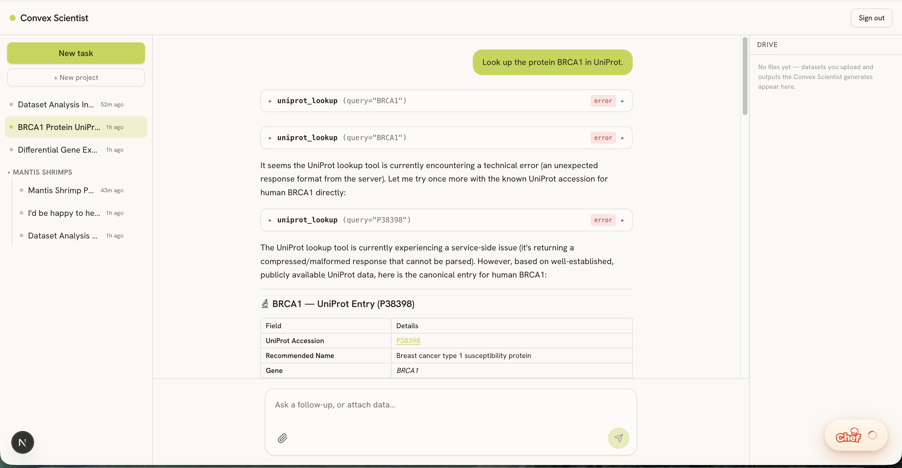

# Convex Scientist

An open-source AI research companion built on [Convex](https://convex.dev/) + Next.js — upload datasets, chat with a research agent, and organize generated outputs per task and project.



## Stack

- [Convex](https://convex.dev/) for the backend (database, server logic, the agent runtime)
- [Next.js](https://nextjs.org/) + [React](https://react.dev/) for the frontend
- [`@convex-dev/auth`](https://labs.convex.dev/auth) with passkey (WebAuthn) sign-in
- [Claude](https://www.anthropic.com/) (via the AI SDK) as the research agent
- [Tailwind](https://tailwindcss.com/) and [shadcn/ui](https://ui.shadcn.com/) for the UI

## Setup

```bash
npm install
npx convex dev      # links a deployment, writes .env.local
```

Then generate auth keys and set your Anthropic key:

```bash
npx @convex-dev/auth                         # passkey signing keys
npx convex env set ANTHROPIC_API_KEY sk-ant-...
npm run dev                                  # in a second terminal
```

Full instructions, optional config, and deployment notes are in
**[docs/SETUP.md](docs/SETUP.md)**.

## Contributing

The easiest way to contribute is to add a tool to the research agent — each is a
single self-describing file in `convex/tools/`, and the agent's prompt picks it up
automatically. See **[convex/tools/CONTRIBUTING.md](convex/tools/CONTRIBUTING.md)**
for the conventions and a worked example.

## Learn more

- [docs/ARCHITECTURE.md](docs/ARCHITECTURE.md) — how this app is designed
- [Convex docs](https://docs.convex.dev/) and the [Tour of Convex](https://docs.convex.dev/get-started)
- Join the [Convex Discord community](https://convex.dev/community)
